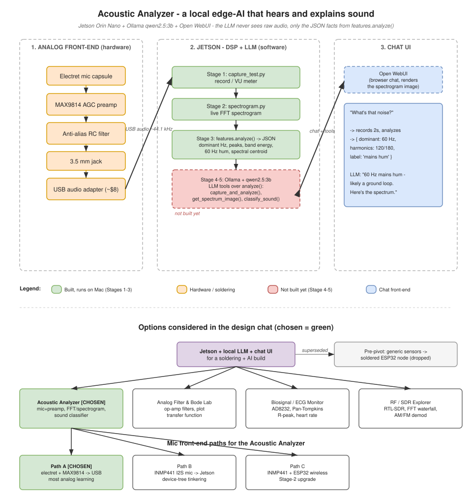

<div align="center">

# 🔊 Acoustic Analyzer

**A local edge-AI that listens through a soldered microphone and explains what it hears.**

Runs entirely on an NVIDIA Jetson — no cloud, and no raw audio ever leaves the box.

</div>



---

## Overview

Acoustic Analyzer is a hands-on **learning project** that combines three skills:
**soldering** an analog microphone front-end, **edge computing** on a Jetson, and **local AI**
with a small tool-calling LLM.

The core idea: a 3-billion-parameter model can't — and shouldn't — listen to a raw waveform.
A Python DSP layer distills each recording into **structured facts** (dominant frequency, tonal
peaks, band energy, a 60 Hz hum score), and the language model reasons over those. That keeps the
model small, the device fully offline, and every answer grounded in real measurements.

```text
you> what's that noise?
  [tool] capture_and_analyze(seconds=2)
  → { "label": "electrical hum (mains-related)", "dominant_hz": 60.0,
      "peaks_hz": [60, 120, 180], "hum_60hz_score": 1.00 }
agent> That's 60 Hz mains hum with harmonics at 120 and 180 Hz — likely a ground loop.
```

## Features

- 🎙️ **Real DSP** — live FFT spectrogram, dominant-tone and peak detection, band energy, and a
  60 Hz mains-hum score.
- 🧠 **Local LLM with tools** — `qwen2.5:3b` on [Ollama](https://ollama.com) calls the DSP as
  tools and explains sounds in plain language. No API keys, no cloud.
- 🔌 **Soldering project** — a ~$25 analog front-end (electret mic → MAX9814 → RC filter → USB).
- 💻 **Develop anywhere** — the same code runs on a Mac or PC today and the Jetson later; only the
  input device changes.

## How it works

```text
①  Analog front-end        ②  Jetson (DSP + LLM)           ③  Chat
   mic → MAX9814 →            capture → features.analyze()     "what's that noise?"
   RC filter → USB      →     → JSON facts → Ollama tools  →   plain-language answer
   (you solder)              (Python, offline)                (terminal or browser)
```

The LLM never touches raw audio — `features.analyze()` is the bridge that turns sound into the
JSON the model reasons over.

## Getting started

Works on your Mac today using the built-in mic; identical on the Jetson later.

**Prerequisites:** Python 3.9+, and [Ollama](https://ollama.com).

```bash
# 1. Local LLM
#    macOS:        brew install ollama
#    Linux/Jetson: curl -fsSL https://ollama.com/install.sh | sh
ollama pull qwen2.5:3b

# 2. Python environment
python3 -m venv .venv
./.venv/bin/pip install -r requirements.txt

# 3. Run the agent
./.venv/bin/python src/agent.py
#    you> what's that noise?
#    you> show me the spectrum        (saves spectrum.png)
```

Full walkthrough and troubleshooting → **[docs/SETUP.md](docs/SETUP.md)**.

## Testing the soldered hardware (no Jetson needed)

The front-end presents as a standard **USB microphone**, so you can verify your soldering on a
**Mac or Windows PC** — plug in the USB audio adapter and run the capture tests. Clear,
OS-by-OS instructions (including the Windows/WSL caveats) are in
**[docs/TEST-HARDWARE.md](docs/TEST-HARDWARE.md)**.

## Repository layout

| File | Purpose |
|------|---------|
| [`src/capture_test.py`](src/capture_test.py) | Prove the mic works — level meter, record, device list |
| [`src/spectrogram.py`](src/spectrogram.py) | Live scrolling FFT spectrogram |
| [`src/features.py`](src/features.py) | `analyze()` — turns audio into structured JSON facts |
| [`src/acoustic_tools.py`](src/acoustic_tools.py) | LLM tools: `capture_and_analyze`, `get_spectrum_image`, `list_input_devices` |
| [`src/agent.py`](src/agent.py) | Terminal chat — local LLM (Ollama) that calls the tools |
| [`requirements.txt`](requirements.txt) | Python dependencies |

## Documentation

| Doc | Contents |
|-----|----------|
| [docs/SETUP.md](docs/SETUP.md) | Install Ollama + the Python env, run the agent |
| [docs/TEST-HARDWARE.md](docs/TEST-HARDWARE.md) | Test the soldered board on a Mac or Windows PC |
| [docs/JETSON-SETUP.md](docs/JETSON-SETUP.md) | Bootstrap the Jetson Orin Nano (Apple-Silicon-friendly) |
| [docs/PROJECT.md](docs/PROJECT.md) | Full design, BOM, roadmap, and future ideas |
| [docs/acoustic-wiring.svg](docs/acoustic-wiring.svg) | Pin-level solder map + checklist |

## Roadmap

- [x] DSP pipeline — capture, spectrogram, feature extraction
- [x] Local tool-calling agent (Ollama + `qwen2.5:3b`)
- [ ] HTTP tool service (FastAPI over the tools)
- [ ] Open WebUI browser front-end
- [ ] Dockerized deploy on the Jetson (GPU + mic passthrough)
- [ ] Log-mel CNN sound classifier
- [ ] NFC "tap-to-analyze" from an iPhone

## Hardware

A ~$25 analog front-end you solder:
**electret mic → MAX9814 preamp → anti-alias RC filter → 3.5 mm jack → USB audio adapter → Jetson.**
The [wiring map](docs/acoustic-wiring.svg), bill of materials, and soldering steps are in
[docs/PROJECT.md](docs/PROJECT.md).

---

<div align="center">
<em>Built on a Mac, deploys to the Jetson unchanged — the DSP distills, the local LLM explains.</em>
</div>
